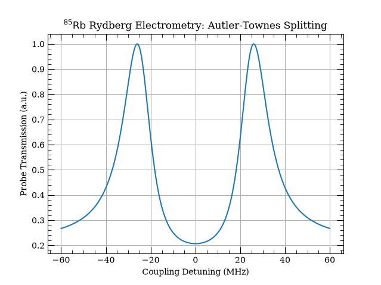

# PQLS: Parallel Quantum Liouvillian Solver

**PQLS** is a high-performance, JAX-accelerated open quantum system solver specifically architected for Rydberg atomic physics and quantum sensing.

By mapping Lindblad master equation steady-states to compiler-optimized tensor operations, PQLS allows researchers to perform massive, multi-dimensional parameter sweeps (e.g., laser detunings, RF field amplitudes) in a fraction of a second.

### Why PQLS?
* **Hardware-Accelerated & Batched:** Uses `jax.vmap` and XLA compilation to solve thousands of steady states simultaneously.
* **Domain-Specific:** Fully integrated with the [Alkali Rydberg Calculator (ARC)](https://arc-alkali-rydberg-calculator.readthedocs.io/), automatically handling energy levels, decay rates, and dipole moments.
* **Differentiable:** Built entirely in pure JAX, making the physics fully compatible with automatic differentiation.
* **Lightweight:** Does not rely on heavy generalized frameworks for the core solver, keeping the dependency tree clean and fast.

---

## Table of Contents
- [Installation](#installation)
- [Quickstart](#quickstart)
- [Examples](#examples)
- [Testing & Benchmarking](#testing--benchmarking)
- [Documentation](#documentation)
- [Acknowledgments](#acknowledgments)

---

## Installation

PQLS requires **Python 3.12+**. We highly recommend installing the package inside a virtual environment to prevent dependency conflicts.

### Standard Installation (For Users)
Clone the repository, create a virtual environment, and install the base package:

```bash
# Clone the repository
git clone https://github.com/Semyazi/pqls.git
cd pqls

# Set up and activate the virtual environment
python3 -m venv .venv
source .venv/bin/activate  # On Windows, use: .venv\Scripts\activate

# Upgrade pip and install the package
pip install --upgrade pip
pip install .
```

### Developer Installation (For Contributors)
If you plan to edit the source code, run benchmarks, or contribute to the project, install the package in "editable" mode along with the `[dev]` dependency group (which includes `pytest`, `qutip`, `matplotlib`, and our linter `ruff`):

```bash
# Install with all developer, testing, and documentation tools
pip install -e ".[dev]"
```

---

## Quickstart

Simulating an N-level atomic system is as simple as defining the states and providing the driving fields. PQLS automatically queries ARC for the physical atomic properties and constructs the Lindbladian.

```python
import matplotlib.pyplot as plt
import numpy as np

from pqls import Driver, QuantumLadder, QuantumState, solve_quantum_ladder

# Define 4-level atomic ladder
ladder = QuantumLadder(
    "Rb85",
    [
        QuantumState(n=5, l=0, j=0.5, mj=0.5),    # |5S_1/2>
        QuantumState(n=5, l=1, j=1.5, mj=1.5),    # |5P_3/2>
        QuantumState(n=50, l=2, j=2.5, mj=2.5),   # |50D_5/2>
        QuantumState(n=51, l=1, j=1.5, mj=1.5),   # |51P_3/2>
    ],
)

# Set field amplitudes (Probe, Coupling, RF in V/m) and detuning sweep
drivers = [Driver(1.0), Driver(8.0e4), Driver(2.0)]
delta_c = np.linspace(-60e6, 60e6, 400)

# Solve steady state across coupling detuning in a single batched call
# The detunings list is aligned with the driver order: [Probe, Coupling, RF]
coherences = solve_quantum_ladder(ladder, drivers, detunings=[0.0, delta_c, 0.0])

# Plot transmission
plt.plot(delta_c / 1e6, np.exp(250.0 * coherences))
plt.xlabel("Coupling Detuning (MHz)")
plt.ylabel("Probe Transmission (a.u.)")
plt.title(r"$^{85}\mathrm{Rb}$ Rydberg Electrometry: Autler-Townes Splitting")
plt.grid(True)
plt.show()
```



---

## Examples

In the `examples/` directory, we provide examples that demonstrate both the functionality of PQLS and its performance.

* **`01_quickstart_ats.py`**: The minimal 4-level ladder simulation shown above.
* **`02_custom_network.py`**: Demonstrates modeling arbitrary topologies (e.g., $\Lambda$-systems with branching decays and Coherent Population Trapping).
* **`03_benchmark_ats.py`**: A direct performance and accuracy benchmark of PQLS against a serial QuTiP solver.
* **`04_benchmark_ats_rydiqule.py`**: A direct performance and accuracy benchmark of PQLS against Rydiqule.
* **`05_ats_transmission_benchmark.py`**: Central probe transmission benchmarking over a logarithmic RF sweep.
* **`06_heatmap.py`**: A highly-optimized, fully vectorized 2D parameter sweep (10,000+ points) producing interference heatmaps.

Run any example directly from your terminal:
```bash
python examples/06_heatmap.py
```

---

## Testing & Benchmarking

PQLS includes a rigorous test suite. Rather than just checking code execution, the test suite dynamically generates random Hamiltonians and verifies the JAX backend against **QuTiP's** standard `steadystate` solver.

Furthermore, the test suite enforces strict quantum mechanical invariants across all batched dimensions:
1. **Unit Trace:** $\text{Tr}(\rho) = 1$
2. **Hermiticity:** $\rho = \rho^\dagger$
3. **Positive Semi-Definiteness:** All eigenvalues $\ge 0$

### Running the Tests
To run the test suite, ensure you have installed the `[dev]` or `[test]` dependencies, then run:

```bash
# Standard test run
pytest

# Detailed view (shows individual parametrized test cases and batch sizes)
pytest -v

# Extra verbose (prints standard output and shows exact numerical diffs if a test fails)
pytest -vv -s
```

---

## Documentation

To generate and view the project documentation locally (requires the `[docs]` dependencies):
TODO

---

## Acknowledgments

This project was developed by **Evan Simanovskis** under the supervision of **Javane Rostampoor** and **Prof. Raviraj Adve** at the University of Toronto. 

The physical parameters, Rydberg transitions, and 2D parameter space provided in the heatmap example are adapted from their work on interference-resilient quantum receivers:

> *J. Rostampoor and R. Adve, "Interference resilient quantum receivers with Rydberg atoms," in Proc. IEEE GLOBECOM Workshops, 2025.*

## License
PQLS is licensed under the **GPL-3.0 License**. See the `LICENSE` file for more details.

## Citing PQLS
If you use PQLS in your research, please click the "Cite this repository" button on the GitHub sidebar to generate the appropriate citation.